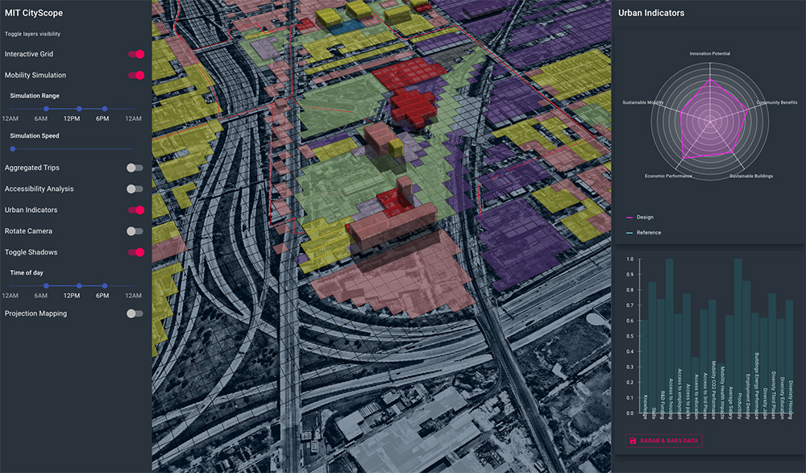
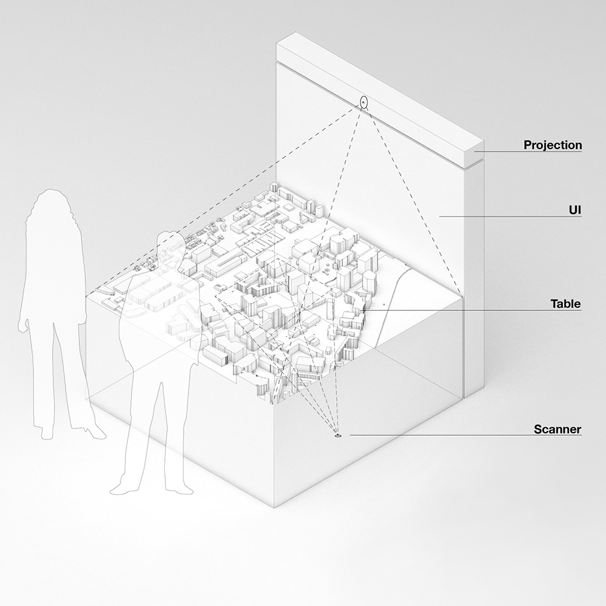

:::warning[Warning]

This documentation is under construction. The content of the documentation may change without prior notice.

:::

## CityScope platform for the web

CityScopeJS is the unified front-end for the [MIT CityScope](https://cityscope.media.mit.edu/) project. CityScopeJS allows users to examine different urban-design alternatives and observe their impact through different KPIs and matrices. CityScopeJS brings together different urban analytics modules, such as traffic simulation, ABM, noise, storm-water, access.

## What is it for?

CityScopeJS is an online tool with a web interface or tangible user interface (TUI). Using the tool, users can input land uses, buildings, open spaces or transport routes, categorize them and enrich their description with details on usability, density and other parameters. This input forms the basis for calculating the various modules and indicators.

This tool also enables collaboration among people within the City Science Network. By using a single tool for defining projects and visualizations, individuals can easily exchange processes, best practices, and even modules.

###### CityScopeJS Web interface



###### CityScopeJS TUI



---

**CityScopeJS exposes two main features: `CityScopeJS Grid Editor` and `CityScopeJS Palyground`**

# CSjs Playground

CSjs Playground is where users interact with the design of urban areas. The tool is built to allow snappy, real-time intervention with various land-uses. The design is then evaluated using different urban analytics modules.

## Quick Start

To explore the app for a known CityScope project, add a CityScope project name to this page URL (for example, `__URL__/?cityscope=corktown` will run [CityScopeJS Corktown](https://cityscope.media.mit.edu/CS_cityscopeJS/?cityscope=corktown) project). You can also explore a list of active CityScope projects [here](https://cityio.media.mit.edu).

When in the app, edit the grid using the editing tool, and explore the different analytics updating

## Development

CityScopeJS is being constantly developed through its frontend, backend and modules. This repo is subject to breaking changes.

In the project directory, you can run: `npm start` Runs the app in the development mode.<br /> Open [http://localhost:3000](http://localhost:3000) to view it in the browser.

#### Hard-Reset cityIO `GEOGRIDDATA` field

**Note!** This feature involves permanent data loss. If your dev created odd data for the grid, you can quickly reset it via:

```
`$ curl https://cityio.media.mit.edu/api/table/clear/__TABLE_NAME__/GEOGRIDDATA`
```

---

# CSjs Grid Editor

The CSjs Grid Editor is a helper tool to bootstrap new CityScope projects. It allow a quick creation of:

- a CityScope endpoint on CityIO
- a geo-located, 3D, editable and contextual CityScope grid
- a list of land-uses to be used during the project

## CityScopeJS schema

This document illustrates the data format and standards for the deployment of a CityScopeJS instance. Being a WIP project, this is subject to change.

## Data Requirements

### `geogrid:geojson`

Minimal data for initiation is a valid GeoJson `FeatureCollection` of at least one `Polygon` feature.
Ideally, this field should be read once on init, due to its size and static state. User should not iterate over it.

```
{
  "type": "FeatureCollection",
  "properties": {
    "header": {},
    "interactive_mapping": {"1245":{"TUI":"1"},"1472":{"WEB":"1"}}
  },

  "features": [
    {
      "type": "Feature",
      "properties": {},
      "geometry": {
        "type": "Polygon",
        "coordinates": [
          [
            [
             __lat__,
              __long__
            ],
            ...
          ]
        ]
      }
    }...
  ]
}
```

**optional fields**

`interactive_mapping`: maps the grid cells that are interactable via the HCI/TUI CityScope interface or web/mobile UI. This allow mixing of different interactions without overwriting. Format

```
{
	"__feature_number__": {
		"TUI": "__TUI_CELL_NUMBER__"
	},
	"__feature_number__": {
		"WEB": "__WEB_INTERACTION_CELL_NUMBER__"
	}
}
```
