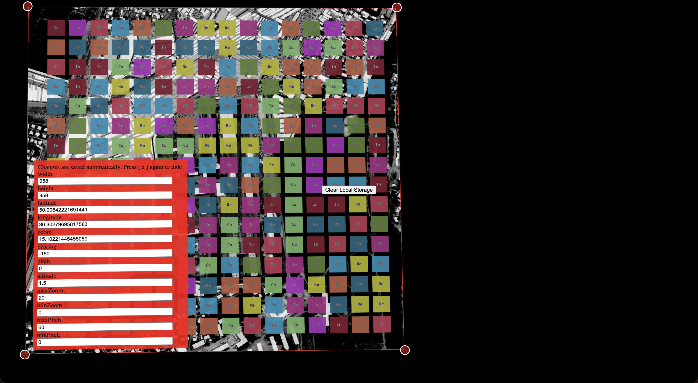

In order to fit in different projector settings to create an accurate projection mapping, there is a tool for modifying it. This page aims to provide a guide on how to use it with existed CityScope project. The available functions for projection mapping tool are:

    1. **Visit Existed CityScope Project** You can start testing out projection mapping by visit the [MIT CityScope Projection Mapping](https://cityscope.media.mit.edu/CS_cityscopeJS_projection_mapping/) project. You can enter your project as url query parameters, for example: https://cityscope.media.mit.edu/CS_cityscopeJS_projection_mapping/?cityscope=kharkiv_me will lead you to the CityScope Kharkiv project.

    ###### Project page

    

    2. **Zoom In and Zoom Out** Once you are navigated to the projection mapping of project, you can zoom in and zoom out based on the actual result from the projector, to see if it fit the actual table.

    ###### Zoom in and zoom out

    

    3. **Keystone** In order to enable keystone functionality, you can press **Space** key and start keystone, you will see red border on the edge and there are dots you can modify based on your need. If you finish editing, press **Space** key again the keystone will disappear.

    ###### Keystone

    

    4. **Panel** In order to enable the panel, you can press **Z** key and start to see different value of view state. It helps you to understand if the view state meet the requirement of what the table needs to display. If you finish using, press **Z** key again the panel will disappear.

    ###### Panel

    

###### Final result

