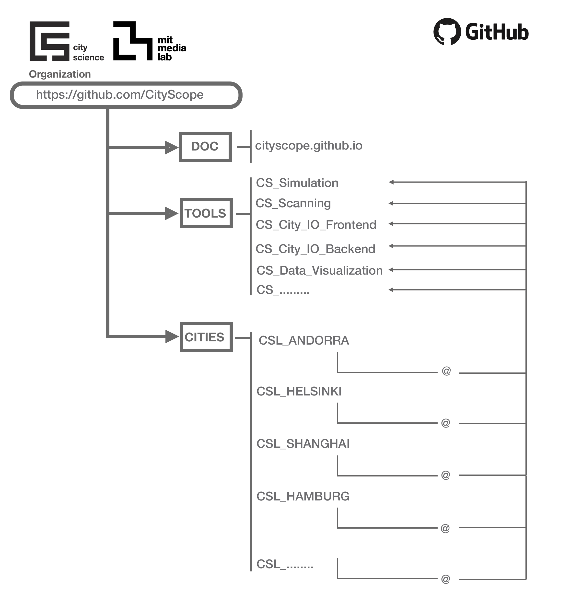

##

CityScope is a project conducted at the MIT Media Lab City Science group. It includes a slew of tangible and digital platforms dedicated to solving spatial design and urban planning challenges. The tools range from simulations that quantify the impact of disruptive interventions in cities to community engagement systems. We develop and deploy these tools around the world and maintain free and open-source community for the majority of our work.

## CityScope Ecosystem

<iframe width="560" height="315" src="https://www.youtube.com/embed/o71Ab4cJ1uA" frameborder="0" allow="accelerometer; autoplay; clipboard-write; encrypted-media; gyroscope; picture-in-picture" allowfullscreen></iframe>

This [website](https://cityscope.github.io) serves documentation for the CityScope project.

### CityScope GitHub Organization Structure

This organization consists two types of repositories.

1. Tools

   Repositories having the prefix of `CS_` are the bare tools that commonly used across city projects.

2. Cities

   Cities have their own repositories that includes links (more exactly submodules) of the above tools and other things. These repos start with `CSL_`.

### CityScopeJS Architecture

CityScopeJS is a modular, open-ended architecture for MIT CityScope project.

CityScopeJS includes several other modules for building, testing and deploying an end-to-end CityScope platform. Each module is developed as a standalone part of the system with minimal dependency on others. Data flow between modules is done using [cityIO](https://cityio.media.mit.edu), which operates between the different modules.

## Analysis modules

Different analysis modules calculate various indicators on urban performance, such as noise, mobility, energy and others. These analysis modules are developed by experts in each evaluation field.

- Urban Indicators module: https://github.com/CityScope/CS_Urban_Indicators
- A service providing mobility simulation, Agent Based Simulation, and aggregated mobility prediction for CityScope projects https://github.com/CityScope/CS_Mobility_Service
- Noise Modeling for Grasbrook, Hamburg: https://github.com/CityScope/CSL_Hamburg_Noise
- Agent Based Modeling https://github.com/CityScope/CS_Simulation_GAMA
- Traffic Simulation module using DLR SUMO https://github.com/CityScope/CS_SUMOscope

## CityScope Server (cityIO)

https://github.com/CityScope/CS_CityIO

## Tangible User Interfaces

- CityScope Scanner: https://github.com/CityScope/CS_CityScoPy

Welcome to the documentation of the **CityScope Software**.

:::warning[Warning]

This documentation and the software it describes are works in progress. The content of the documentation or the software may change without prior notice.

:::

## Getting Started

CityScope Beta features an architecture that is similar to the previous version, consisting of three core components:

- [CityIO](https://github.com/CityScope/CS_CityIO/):
  - Enables the communication between the different components of the system.
  - Saves the projects to access them seamlessly in all the components.
  - Rebuilt to allow real-time communication, using WebSockets.
- [CityScopeJS](https://github.com/CityScope/CS_cityscopeJS/):
  - User interface to interact with the CityScope projects.
  - Rebuilt to use CityIO Websockets.
  - New user experience.
- [Brix](https://github.com/CityScope/CS_Brix/):
  - Python library to ease the creation of CityScope modules.
  - Handles the communication with CityIO.

The image below illustrates the components currently available in the CityScope Beta Software architecture. Additional components can be incorporated as required in the future.

