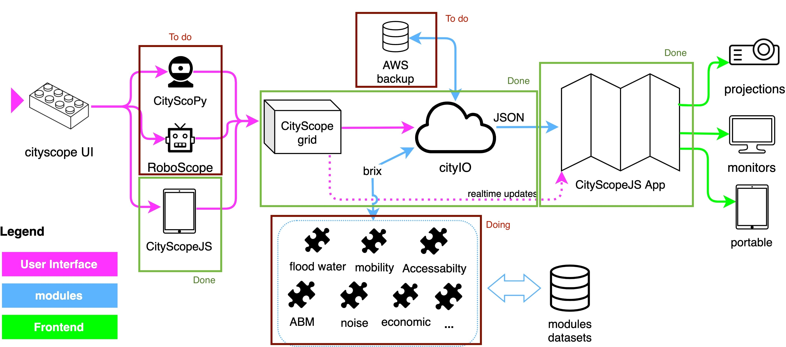

# Development on GitHub

CityScope is open-source software and is primarily hosted on GitHub. The organization structure is designed to facilitate the development and deployment of CityScope projects. The organization consists of two types of repositories: tools and cities.

The image below illustrates the components currently available in the CityScope Beta Software architecture. Additional components can be incorporated as required in the future.

## General development guidelines

There are many different repositories in the CityScope organization, and each one may have its own development guidelines, license, and contributing guidelines. However, there are some general guidelines that apply to all repositories:

- contact the maintainers of the repository to make sure your contribution is in line with the project's goals
- Fork the repository and make your changes in your fork
- Create a pull request to the original repository
- Make sure your code is well-documented and tested

## Repos Structure

This organization consists two types of repositories.

1. Tools

   Repositories having the prefix of `CS_` are the bare tools that commonly used across city projects.

2. Cities

   Cities have their own repositories that includes links (more exactly submodules) of the above tools and other things. These repos start with `CSL_`.

