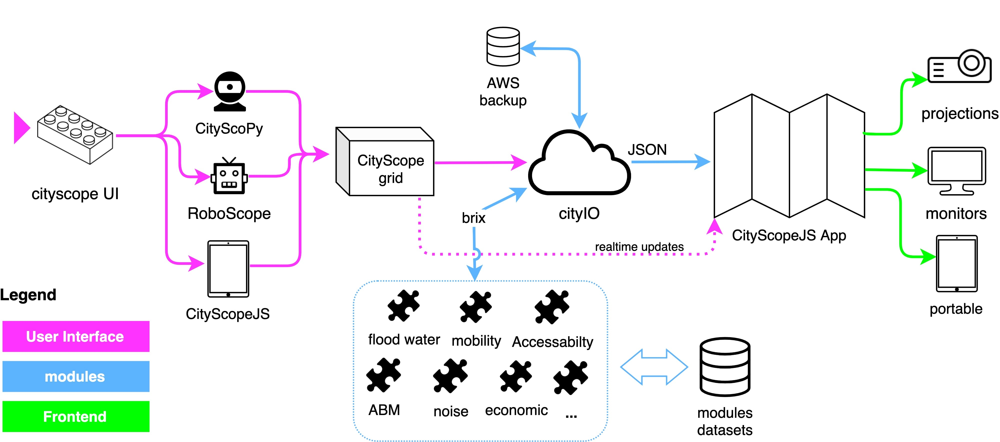

# System Architecture

CityScope is composed of a series of tools loosely connected to each other. The tools are developed in different languages and frameworks, and they communicate through a central server, CityIO.

## CityScopeJS

CityScopeJS is a modular, open-ended architecture for MIT CityScope project.

- User interface to interact with the CityScope projects
- Uses CityIO Websockets to communicate with the server
- New user experience and design for the CityScope projects

<!-- small text -->

###### Figure: CityScopeJS Architecture (Photo: Ariel Noyman)

CityScopeJS includes several other modules for building, testing and deploying an end-to-end CityScope platform. Each module is developed as a standalone part of the system with minimal dependency on others. Data flow between modules is done using [cityIO](https://cityio.media.mit.edu), which operates between the different modules.

## Modules

Different analysis modules calculate various indicators on urban performance, such as noise, mobility, energy and others. These analysis modules are developed by experts in each evaluation field.

- Urban Indicators module: https://github.com/CityScope/CS_Urban_Indicators
- A service providing mobility simulation, Agent Based Simulation, and aggregated mobility prediction for CityScope projects https://github.com/CityScope/CS_Mobility_Service
- Noise Modeling for Grasbrook, Hamburg: https://github.com/CityScope/CSL_Hamburg_Noise
- Agent Based Modeling https://github.com/CityScope/CS_Simulation_GAMA
- Traffic Simulation module using DLR SUMO https://github.com/CityScope/CS_SUMOscope

## CityScope Server (cityIO)

CityIO is a server program that saves tables to have different software (visualization, simulation) read/write information. It exposes an API to serve JSON files representing table info.

- Enables the communication between the different components of the system.
- Saves the projects to access them seamlessly in all the components.
- Rebuilt to allow real-time communication, using WebSockets.

See https://github.com/CityScope/CS_CityIO

## Tangible User Interfaces

CityScope also includes tangible user interfaces (TUIs) that allow users to interact with the system in a physical way. These interfaces are developed using the CityScopeJS platform.

- CityScope Scanner: https://github.com/CityScope/CS_CityScoPy
