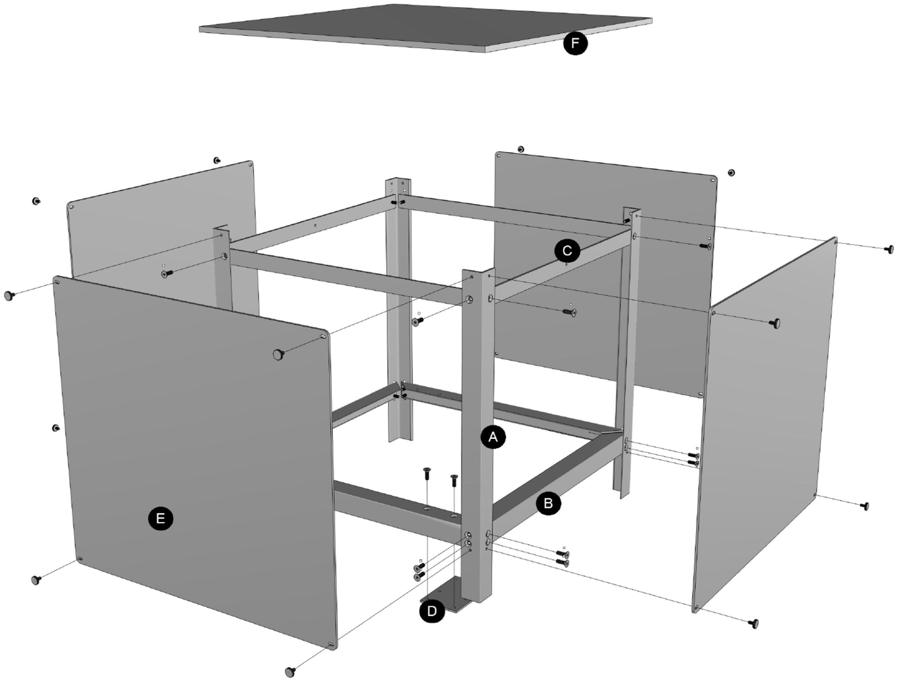

## How to choose the area and scale?
Typically, the area shown on a City Scope table covers approximately 1 km x 1 km, providing a detailed and manageable visualization of urban spaces. The dimensions of the table itself can vary, with common sizes being either 1.5m x 1.5m (square) or 0.7m x 1.6m (rectangle). These dimensions are adaptable based on the specific area we want to display and the desired scale of the 3D model. Key factors:

- Urban Density and Complexity: Areas with higher density and complexity might require a smaller scale to capture all the necessary details.

- User Interaction: The ease with which users can interact with and interpret the model influences the scale. A larger scale might be needed for more interactive models.

- Space Availability: The physical space where the table will be placed determines its maximum size.

- Audience and Accessibility: The table's size and height are adjusted for accessibility, ensuring that it can be comfortably viewed and interacted with by all users.

## Physical table
The main components of a CityScope table will be:

- Structure: 80/20 modular aluminum sections. The Aluminum Structure is made from aluminum extrusions made by a company called 80/20. See the following link for the USA distributor website: https://8020.net/. 80/20 is a modular T-structure that includes the parts/accessories needed to attach the lengths of the aluminum structure.

- Tabletop: Clear Acrylic (or Plexiglass) Table Top. Usually a thickness of 10mm depending on the size of the table. 

- Cladding: Opaque Acrylic Cladding. An Opaque material is needed to block light. We used acrylic, but the cladding could be plywood or the like.

## 3D Model
- Grid: The grid is very important especially if the table is intended to be interactive. The grid enables the precise placement of the Lego pieces, ensuring the model's functionality and user engagement.
   - Use an opaque acrylic sheet, typically laser-cut for precision.
   - Decide on the size of the grid squares based on the scale of your model and the specific requirements of the interactive elements.
   - The grid should be placed on top of the clear acrylic sheet.

- Lego: We use White Lego blocks to build the model because they are modular, making construction straightforward and adaptable. This approach is the easiest way to assemble the model and allows for easy replacement in case of updates or breakages.

- Design. As part of the design process, it is extremely important to obtain a 3D file of the area where we would like to build the model. In the next step, you have the option of choosing one of the following methodologies:
   - “Legotizers” (Software). Some software programs can "legotize" a 3D model when they are imported into them.
   - “Traditional” way. Using a computer program such as Autocad or Illustrator, you can draw it manually.

- Quantity. Check some shopping lists of previous projects for reference:
   - Andorra: https://drive.google.com/file/d/1SsdtnMkNdTvMa9eU5A0OpCf5sslOETs2/view?usp=drive_link
   - BioBio: https://docs.google.com/spreadsheets/d/1pOWZSz6maTB3moMfFDxShWXYnz78eIkmATCjh00wz-o/edit?usp=sharing

## Computer
To run the City Scope table effectively, specific computer characteristics are necessary to ensure optimal performance. There are two common setups: one with a server and a local computer, and another with just a local computer. Below are the detailed requirements for each setup:

- Server requirements:
   - RAM: Minimum 16GB
   - GPU: A graphics processing unit with at least 4GB of VRAM
   - CPU: A minimum of a 2-core 64-bit processor

- Local Computer requirements:
   - RAM: Minimum 16GB, with a preference for more to enhance performance
   - GPU: A graphics processing unit with at least 4GB of VRAM. Compatible models include:
        - NVIDIA: GeForce 2xxx series or higher
        - AMD/ATI: Radeon 4xxx series or higher
   - CPU: A 64-bit processor with more than 4 cores for efficient multitasking and processing power

## Projector
To ensure the City Scope table functions optimally with clear and vivid projections, it's crucial to select a projector that meets specific characteristics. Here are the recommended features:

- Brightness:
   - ANSI Lumens: A minimum of 4500 lumens is required. Brightness is prioritized over resolution to ensure the projections are visible even in well-lit environments.

- Resolution:
   - HD Resolution: The projector should have a resolution of at least 1920 x 1200 (WUXGA). This provides clear and detailed images necessary for the precision required in City Scope applications.

- Light Source:
   - Laser: The projector should use a laser light source rather than a traditional lamp or bulb. Laser projectors offer longer lifespans, better brightness consistency, and lower maintenance.

- Image Throw:
   - Short Throw: If the ceiling height is low, a short-throw projector is essential. This allows the projector to create large images from a short distance, minimizing shadows and maximizing space.

- Example Model:
Panasonic PT-VMZ40U: This model fits the requirements with appropriate brightness, resolution, and a laser light source.

- Projection Calculator: To determine the best projector options for your specific setup, you can use the following calculator: Projector Central's Projection Calculator.

## Accessories
We recommend incorporating the following accessories:

- Webcam:  
   - Infra-red cameras: For optimal performance, use infrared cameras instead of traditional webcams. Infrared cameras are less susceptible to visible light interference, ensuring more accurate and reliable tracking and imaging.

- Mouse: 
   - Wireless Mouse: A wireless mouse is recommended to reduce cable clutter and provide more flexibility in movement and positioning around the table.

- Keypad: 
   - Wireless Keypad: Similar to the mouse, a wireless keypad is recommended. This allows for easy and flexible use without the constraints and mess of cables, contributing to a cleaner and more efficient workspace.

