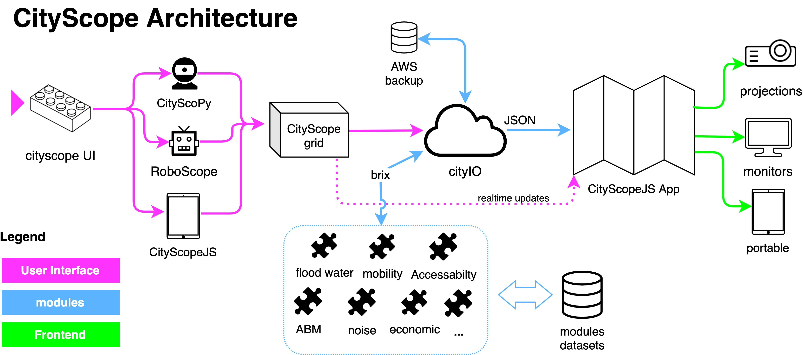

CityScopeJS is a modular, open-ended architecture for MIT CityScope project.

## CityScope Architecture

CityScopeJS includes several other modules for building, testing and deploying an end-to-end CityScope platform. Each module is developed as a standalone part of the system with minimal dependency on others. Data flow between modules is done using [cityIO](https://cityio.media.mit.edu), which operates between the different modules.

## Analysis modules

Different analysis modules calculate various indicators on urban performance, such as noise, mobility, energy and others. These analysis modules are developed by experts in each evaluation field.

-   Urban Indicators module: https://github.com/CityScope/CS_Urban_Indicators
-   A service providing mobility simulation, Agent Based Simulation, and aggregated mobility prediction for CityScope projects https://github.com/CityScope/CS_Mobility_Service
-   Noise Modeling for Grasbrook, Hamburg: https://github.com/CityScope/CSL_Hamburg_Noise
-   Agent Based Modeling https://github.com/CityScope/CS_Simulation_GAMA
-   Traffic Simulation module using DLR SUMO https://github.com/CityScope/CS_SUMOscope

## CityScope Server (cityIO)

https://github.com/CityScope/CS_CityIO

## Tangible User Interfaces

-   CityScope Scanner: https://github.com/CityScope/CS_CityScoPy
