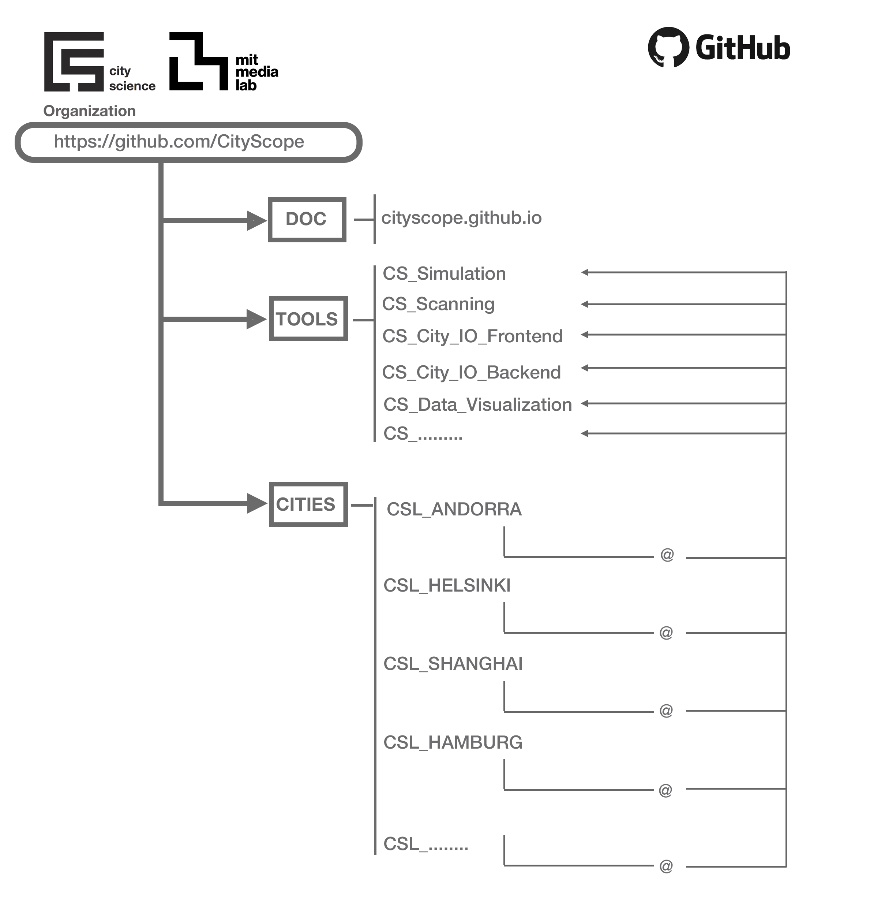

## MIT CityScope

### What is CityScope?

CityScope is a project conducted at the MIT Media Lab City Science group. It includes a slew of tangible and digital platforms dedicated to solving spatial design and urban planning challenges. The tools range from simulations that quantify the impact of disruptive interventions in cities to community engagement systems. We develop and deploy these tools around the world and maintain free and open-source community for the majority of our work.

This [website](https://cityscope.github.io) serves documentation for the CityScope project.

### CityScope GitHub Organization Structure

This organization consists two types of repositories.

1. Tools

    Repositories having the prefix of `CS_` are the bare tools that commonly used across city projects.

2. Cities

    Cities have their own repositories that includes links (more exactly submodules) of the above tools and other things. These repos start with `CSL_`.

